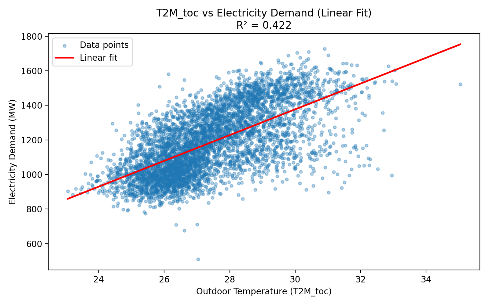
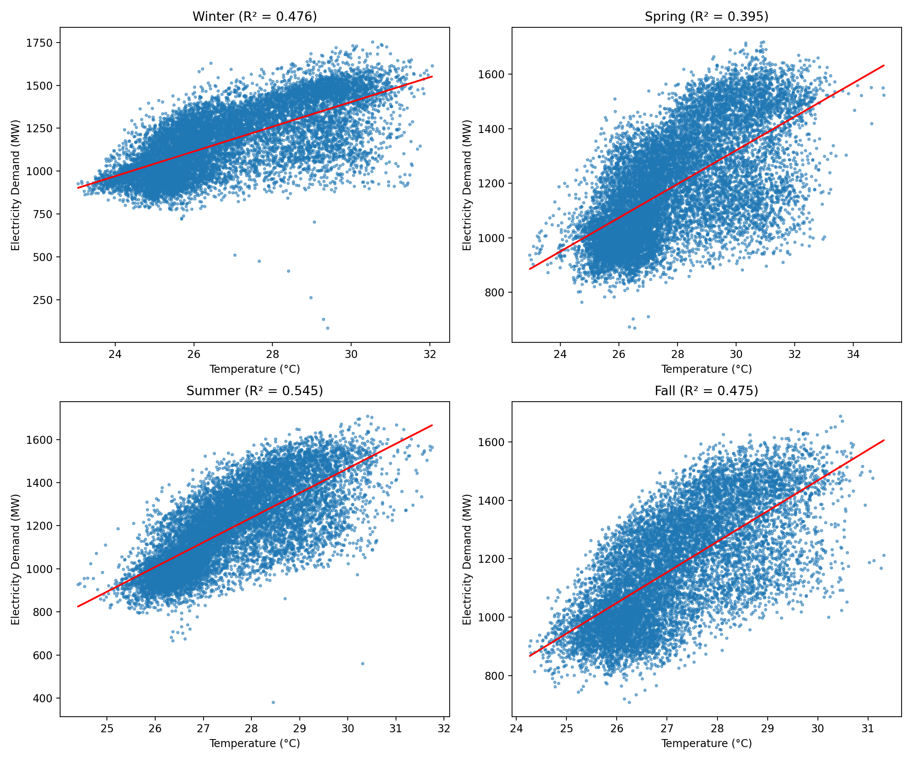

# Hourly Electricity Load Forecasting for BEMS

This project is the final assignment for **EF2039 AI Programming (Term Project 02)**.  
It develops a machine learning pipeline that predicts **hourly national electricity load**, a key function of **Building Energy Management Systems (BEMS)**.

---

## 1. Dataset

- **Source:** Kaggle (national load + weather + calendar dataset)
- **Target variable:** `nat_demand` (national electricity load in MW)

### Key Features
- **Time features:** hour, day of week, month, is_weekend  
- **Weather features:** T2M_toc, QV2M_toc, TQL_toc, W2M_toc  
- **Demand history:** lag1, lag24, rolling means (3h, 24h)  
- **Calendar:** holiday, school  

Raw dataset path:  `data/continuous_dataset.csv`

---

## 2. Project Structure

```
EF2039_PROJ02_ChaewonLee/
├── data/
│   └── continuous_dataset.csv
│
├── src/
│   ├── load_forecasting.py
│   ├── linear_temp_vs_demand.py
│   └── seasonal_temp_vs_demand.py
│
├── results/
│   ├── hourly_load_prediction.png
│   ├── linear_T2M_vs_demand.png
│   └── seasonal_T2M_vs_demand.png
│
├── requirements.txt
└── README.md
```

---

## 3. Installation & Execution

### Install dependencies
```bash
pip install -r requirements.txt
```

### Run the forecasting script
```bash
cd src
python load_forecasting.py
```

This script will:

- Train three ML models  
  - Linear Regression  
  - Random Forest  
  - Gradient Boosting  
- Evaluate using MAE, RMSE, R²  
- Select the **best-performing model**  
- Save prediction output at:  
  `results/hourly_load_prediction.png`

---

## 4. Exploratory Analysis

### Linear temperature vs demand


### Seasonal analysis


These analyses show that temperature alone is not sufficient, reinforcing the need for **multi-feature, time-aware forecasting.**

---

## 5. Model Performance

| Model              | MAE     | RMSE    | R²     |
|-------------------|---------|---------|--------|
| Linear Regression | 34.2048 | 45.1785 | 0.9410 |
| Random Forest     | 15.2550 | 21.8891 | 0.9861 |
| Gradient Boosting | 18.4976 | 24.5252 | 0.9826 |

✔ **Random Forest achieved the highest performance (R² = 0.986).**

---

## 6. Visualization Example

### Actual vs Predicted Electricity Load (Test Set)


The Random Forest model captures both daily and seasonal demand cycles effectively.

---

## 7. Conclusion

This project built a complete ML pipeline for hourly electricity load forecasting using:

- Temporal features  
- Weather conditions  
- Lag and rolling window features  
- A modular and maintainable workflow  

The Random Forest Regressor achieved the best performance (R² = 0.986),  
showing strong potential for integration into **Building Energy Management Systems (BEMS)** for:

- HVAC scheduling  
- ESS charging optimization  
- Demand-response planning  
- Peak-load prediction  

---

## 8. Future Improvements

- Apply deep learning models (LSTM, GRU, Transformer)  
- Add more meteorological inputs  
- Separate weekday/weekend models  
- Real-time adaptive forecasting  

---

## 9. Author

**Chaewon Lee (20240516)**  
EF2039 AI Programming — Term Project 02


