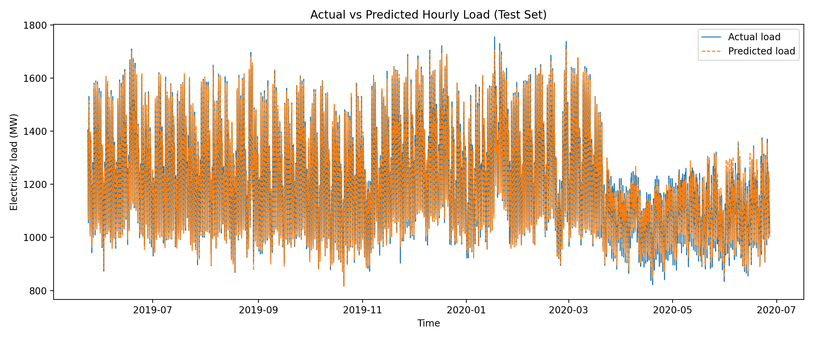

# Hourly Electricity Load Forecasting for BEMS

This project is the final assignment for **EF2039 AI Programming Term Project 02**.  
The goal is to build a machine learning pipeline that predicts **hourly national electricity load**, an essential function of **Building Energy Management Systems (BEMS)**.

The project includes:
- Data preprocessing  
- Feature engineering  
- Model training and performance comparison  
- Visualization of prediction results  

---

## 1. Dataset

- **Source:** Kaggle (continuous national electricity demand dataset with weather & calendar variables)
- **Target variable:** `nat_demand` (national electricity load in MW)
- **Key input features**
  - **Time features:** hour, day of week, month, is_weekend  
  - **Weather features:** T2M_toc, QV2M_toc, TQL_toc, W2M_toc  
  - **Demand history:** lag1, lag24, rolling means (3h, 24h)  
  - **Calendar features:** holiday, school  

The raw CSV file is stored in: `data/continuous_dataset.csv`.

---
## 2. Project Structure

```
EF2039_Proj02_ChaewonLee/
├── data/
│   └── continuous_dataset.csv
│
├── src/
│   └── load_forecasting.py
│
├── results/
│   └── hourly_load_prediction.png
│
├── requirements.txt
└── README.md
```


---

---

## 3. Installation & Execution

### 1) Install required packages
Install all dependencies using:

```bash
pip install -r requirements.txt
```

---

### 2) Run the forecasting script

Execute the main forecasting pipeline:

```bash
cd src
python load_forecasting.py
```

### Output description
Running the script will:

- Train three machine learning models:
  - **LinearRegression**
  - **RandomForestRegressor**
  - **GradientBoostingRegressor**

- Evaluate each model using:
  - **MAE** (Mean Absolute Error)
  - **RMSE** (Root Mean Squared Error)
  - **R² Score**

- Automatically select the **best-performing model**
- Generate and save prediction visualization at:

```bash
results/hourly_load_prediction.png
```

---

## 4. Model Performance

The following table summarizes the evaluation results on the test dataset:

```
Model                MAE        RMSE        R²
------------------------------------------------
Linear Regression    34.2048    45.1785     0.9410
Random Forest        15.2550    21.8891     0.9861
Gradient Boosting    18.4976    24.5252     0.9826
```

👉 **Random Forest achieved the best performance**, demonstrating strong predictive capability for hourly electricity demand.

---

## 5. Visualization Example

The following plot is automatically generated after running the script:

### Actual vs Predicted Electricity Load (Test Set)

<p align="center">
  
</p>

This visualization shows that the predicted load closely follows the actual load trends, especially when using the Random Forest model.

---

## 6. Conclusion

This project successfully developed a complete machine learning pipeline for forecasting hourly electricity load using time-series, weather, and historical demand features.

Among all evaluated models, the **Random Forest Regressor** demonstrated the highest accuracy with an R² score of **0.986**, indicating excellent predictive performance.

The results show strong potential for integration into **Building Energy Management Systems (BEMS)** to support smarter and more efficient energy usage.

---

## 7. Future Improvements

Possible enhancements include:

- Applying deep learning models (LSTM, Transformer-based models)
- Incorporating additional meteorological variables
- Building separate models for weekdays vs. weekends
- Developing real-time adaptive prediction for smart grid environments

---

## 8. Author

**Chaewon Lee (20240516)**  
EF2039 AI Programming — Term Project 02

---
This README was updated after completing the main implementation.


